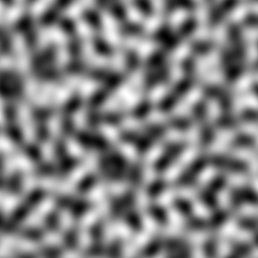
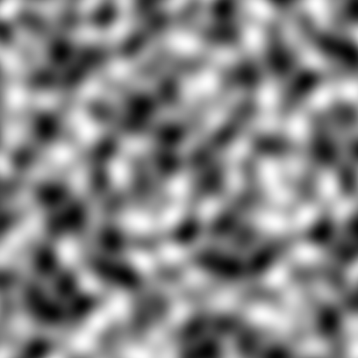

# Noise::Simplex

## Introduction

This is a naive implementation of 2D & 3D simplex noise in Raku.

It is not performant, but I believe it is correct.

Pull requests are welcome.

## Usage

```raku
use Noise::Simplex;
use Image::PNG::Portable;

my $width = 512;
my $height = 512;
my $simplex = Simplex.new(seed => 12345);
my &noise2d = $simplex.create-noise2d;

my $img = Image::PNG::Portable.new: :$width, :$height, :alpha(False);

my @pixels;
for 0 ..^ $height -> $y {
    for 0 ..^ $width -> $x {
        my $n = noise2d($x / 64, $y / 64);
        my $val = ($n + 1) * 127.5;
        $img.set: $x, $y, $val.round, $val.round, $val.round;  # R, G, B grayscale
    }
}

$img.write: "img/2d.png";
```

See `examples/3dnoise.raku` for a 3D example.

## Functions

### Simplex.new

Takes a seed, returns a Simplex noise generator.

### Simplex.create-noise2d

Creates a 2D noise map based on your seed, returns a sub that takes $x, $y to sample noise.

### Simplex.create-noise3d

Creates a 3D noise map based on your seed, returns a sub that takes $x, $y, $z to sample noise.

## Example Noise

### 2D Noise



### 3D Noise



*Animated png made with [ezgif](https://ezgif.com/apng-maker).*
